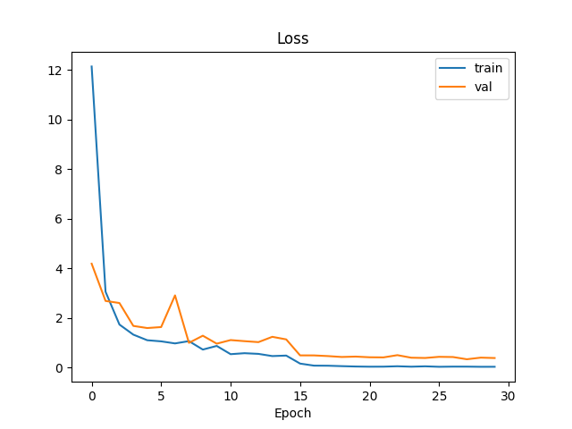
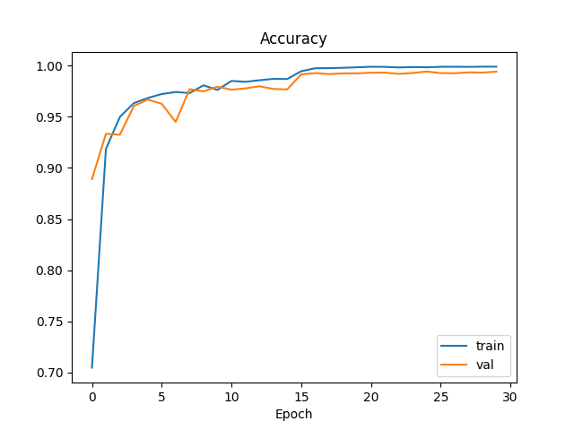

# Overview
Implement the paper [Architecturing Binarized Neural Networks for Traffic Sign Recognition](https://arxiv.org/abs/2303.15005)

# Requirement
__pip install all below__  
- tensorflow2
- tqdm
- pandas
- numpy
- scikit-learn
- matplotlib
- PIL
- [larq](https://docs.larq.dev/larq/)

# Dataset
[GTSRB](https://www.kaggle.com/datasets/meowmeowmeowmeowmeow/gtsrb-german-traffic-sign?datasetId=82373&language=Python)
- __Step 1__  
  Download the zip file from the link
- __Step 2__  
  Unzip the data to any folder
  
# Train
```
python train.py -data gtrsb/ -bs 64 -sz 64 -epoch 30
```
`-data` is the folder path where your GTSRB data save.

# Result
- __Average accuracy on test data is 96%__
- __Loss__


- __Accuracy__

